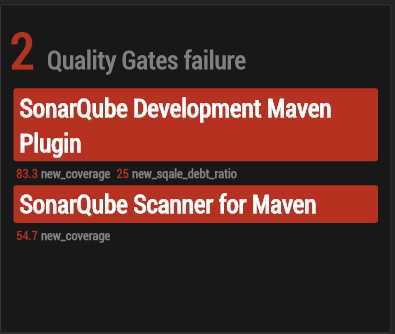

Atlasboard SonarQube Package
============================

## End of life

This project is no more active

## Description

Atlasboard jobs and widgets for querying and displaying SonarQube on a dashboard.

Widget available, display of the red quality gates:




## License

Copyright 2008-2016 SonarSource.

Licensed under the [GNU Lesser General Public License, Version 3.0](http://www.gnu.org/licenses/lgpl.txt)

## Build status

[](https://travis-ci.org/SonarQubeCommunity/atlasboard-sonarqube-package)

## Installation

This package is available as a git submodule.
See [Package-Atlassian](https://bitbucket.org/atlassian/atlasboard/wiki/Package-Atlassian) how to include it in your wallboards.

## Requirements

SonarQube 5.5 or better.

## Available Widgets

### qg-filter

Report the red quality gates found in a set of projects.

#### Configuration
In your globalAuth.json file you need an entry for your SonarQube instance.
```JSON
"sonarqube": {
  "rootURL": "https://sonarqube.hogwarts.edu/contextIfAny",
  "username": "harry.potter",
  "password": "magictrick"
},
```

In your dashboard definition:
```JSON
"qg-filter": {
  "interval": 180000,
  "widgetTitle": "Quality Gate Failures",
  "filterProjects": "search=sonar",
  "days_since_last_commitMax": 30,
  "credentials": "sonarqube"
},
```

`filterProjects` is optional, it may be used to filter the projects, see doc [here](https://sonarqube.com/web_api/api/projects/index) for details.
`days_since_last_commitMax` is optional too.

## Contributions

* forum: https://groups.google.com/forum/#!forum/sonarqube
* raise a bug, propose a new feature: https://github.com/SonarQubeCommunity/atlasboard-sonarqube-package/issues
* run the test: `npm test`
* compute the coverage: `npm run coverage`
